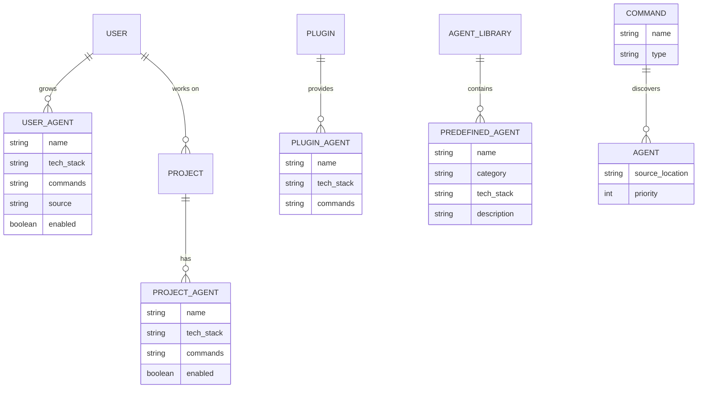

# Grow Your Own Garden: Adaptive Agent Ecosystem

> **Issue Reference:** https://github.com/EveryInc/compounding-engineering-plugin/issues/20
> **Date:** 2025-11-27
> **Status:** Draft Plan

## Overview

Transform the compounding-engineering plugin from a monolithic collection into an **adaptive ecosystem** where users grow their own personalized agent gardens from a minimal seed. The core loop (`/plan`, `/work`, `/review`, `/compound`) stays universal, but each user's agent collection evolves based on their learnings.

**Philosophy:** Everyone grows their own garden, but we're all using the same process.

---

## Problem Statement

### Current State
- Monolithic plugin: 24 agents, 16 commands, 11 skills
- Users get everything, use maybe 30%
- No personalization - same agents for Rails developer and Python developer
- No growth mechanism - static collection that doesn't adapt

### Desired State
- Minimal seed: 4 commands + ~6 core agents
- Organic growth: `/compound` suggests relevant agents based on learnings
- Personalized gardens: Rails developer accumulates Rails experts, Python developer accumulates Python experts
- Shared process: Core workflow identical across all users

---

## Proposed Solution

### Architecture: Seed + Growth Model

```
┌─────────────────────────────────────────────────────────────────┐
│                    SEED PLUGIN (Core)                           │
│  ┌──────────┐ ┌──────────┐ ┌──────────┐ ┌──────────┐          │
│  │  /plan   │ │  /work   │ │ /review  │ │/compound │          │
│  └──────────┘ └──────────┘ └──────────┘ └──────────┘          │
│                                                                 │
│  Core Agents: security-sentinel, performance-oracle,           │
│               code-simplicity-reviewer, architecture-strategist │
│               pattern-recognition-specialist                    │
└─────────────────────────────────────────────────────────────────┘
                              │
                              │ /compound triggers growth
                              ▼
┌─────────────────────────────────────────────────────────────────┐
│                    USER'S GARDEN (~/.claude/agents/)            │
│                                                                 │
│  ┌─────────────────┐  ┌─────────────────┐  ┌─────────────────┐ │
│  │ Predefined      │  │ Dynamic         │  │ Custom          │ │
│  │ (from library)  │  │ (generated)     │  │ (user-written)  │ │
│  │                 │  │                 │  │                 │ │
│  │ • dhh-rails     │  │ • actor-model   │  │ • our-api-style │ │
│  │ • kieran-python │  │   expert        │  │ • team-patterns │ │
│  │ • typescript    │  │ • graphql-best  │  │                 │ │
│  │   reviewer      │  │   practices     │  │                 │ │
│  └─────────────────┘  └─────────────────┘  └─────────────────┘ │
└─────────────────────────────────────────────────────────────────┘
                              │
                              │ /review discovers all agents
                              ▼
┌─────────────────────────────────────────────────────────────────┐
│                    PROJECT OVERRIDES (.claude/agents/)          │
│                                                                 │
│  Project-specific agents that override or supplement global     │
│  ┌─────────────────┐                                           │
│  │ • cora-specific │ (only runs in ~/Reels/cora/)              │
│  │ • hotwire-native│                                           │
│  └─────────────────┘                                           │
└─────────────────────────────────────────────────────────────────┘
```

### The Growth Loop

```
User completes work
        │
        ▼
  Runs /compound
        │
        ▼
System analyzes:
• Git diff (files changed, patterns)
• Tech stack (Gemfile, package.json)
• Learning content
        │
        ▼
┌───────────────────────────────────────────────────┐
│           SUGGESTION ENGINE                        │
│                                                    │
│  Match detected patterns against:                  │
│  1. Predefined agent library (curated)            │
│  2. Dynamic generation capability                  │
│  3. User's existing agents (avoid duplicates)     │
│                                                    │
└───────────────────────────────────────────────────┘
        │
        ▼
  Three possible outcomes:
        │
        ├─► "You're using Rails. Add DHH reviewer?" [y/n]
        │   (Predefined agent from library)
        │
        ├─► "You're using actor model. Create an expert?" [y/n]
        │   (Dynamic agent generation)
        │
        └─► "Want to create a custom agent for this pattern?" [y/n]
            (User-defined agent)
        │
        ▼
  Agent added to ~/.claude/agents/
        │
        ▼
  Next /review includes new agent
```

---

## Technical Approach

### Phase 1: Split Into Core + Agent Library

**New Marketplace Structure:**

```
every-marketplace/
├── .claude-plugin/
│   └── marketplace.json
├── plugins/
│   ├── compounding-engineering/          # CORE (seed)
│   │   ├── .claude-plugin/plugin.json
│   │   ├── agents/
│   │   │   ├── review/
│   │   │   │   ├── security-sentinel.md
│   │   │   │   ├── performance-oracle.md
│   │   │   │   ├── code-simplicity-reviewer.md
│   │   │   │   ├── architecture-strategist.md
│   │   │   │   └── pattern-recognition-specialist.md
│   │   │   ├── research/
│   │   │   │   ├── best-practices-researcher.md
│   │   │   │   ├── framework-docs-researcher.md
│   │   │   │   ├── git-history-analyzer.md
│   │   │   │   └── repo-research-analyst.md
│   │   │   └── workflow/
│   │   │       ├── bug-reproduction-validator.md
│   │   │       └── spec-flow-analyzer.md
│   │   ├── commands/
│   │   │   └── workflows/
│   │   │       ├── plan.md
│   │   │       ├── work.md
│   │   │       ├── review.md
│   │   │       └── compound.md
│   │   ├── skills/
│   │   │   ├── compound-docs/
│   │   │   ├── file-todos/
│   │   │   ├── git-worktree/
│   │   │   ├── create-agent-skills/
│   │   │   └── skill-creator/
│   │   └── mcp-servers/
│   │       ├── playwright
│   │       └── context7
│   │
│   └── agent-library/                    # OPTIONAL (predefined agents)
│       ├── .claude-plugin/plugin.json
│       ├── rails/
│       │   ├── kieran-rails-reviewer.md
│       │   ├── dhh-rails-reviewer.md
│       │   └── data-integrity-guardian.md
│       ├── python/
│       │   └── kieran-python-reviewer.md
│       ├── typescript/
│       │   └── kieran-typescript-reviewer.md
│       ├── frontend/
│       │   ├── julik-frontend-races-reviewer.md
│       │   ├── design-iterator.md
│       │   ├── design-implementation-reviewer.md
│       │   └── figma-design-sync.md
│       └── editorial/
│           └── every-style-editor.md
└── docs/
```

**Core Plugin Components (Seed):**

| Category | Components | Count |
|----------|------------|-------|
| Commands | /plan, /work, /review, /compound | 4 |
| Review Agents | security, performance, simplicity, architecture, patterns | 5 |
| Research Agents | best-practices, framework-docs, git-history, repo-analyst | 4 |
| Workflow Agents | bug-reproduction, spec-flow | 2 |
| Skills | compound-docs, file-todos, git-worktree, create-agent-skills, skill-creator | 5 |
| MCP Servers | playwright, context7 | 2 |
| **TOTAL** | | **22 components** |

**Agent Library (Optional Install):**

| Category | Agents | Count |
|----------|--------|-------|
| Rails | kieran-rails, dhh-rails, data-integrity | 3 |
| Python | kieran-python | 1 |
| TypeScript | kieran-typescript | 1 |
| Frontend | julik-races, design-iterator, design-reviewer, figma-sync | 4 |
| Editorial | every-style-editor | 1 |
| **TOTAL** | | **10 agents** |

### Phase 2: Agent Discovery & Storage

**Agent Storage Locations (priority order):**

```
1. Project agents:    .claude/agents/*.md        (highest priority)
2. User agents:       ~/.claude/agents/*.md      (user's garden)
3. Plugin agents:     plugin/agents/*.md         (from installed plugins)
```

**Agent Metadata Format (frontmatter):**

```yaml
---
name: dhh-rails-reviewer
description: Reviews Rails code from DHH's perspective
tech_stack: [rails, ruby]           # When to suggest
commands: [review]                  # Which commands use this
priority: 10                        # Execution order (higher = first)
source: predefined                  # predefined | dynamic | custom
version: 1.0.0
enabled: true                       # Can be disabled without deletion
---
```

**Discovery Mechanism:**

```ruby
# Pseudocode for /review agent discovery
def discover_agents(command: "review")
  agents = []

  # 1. Project agents (highest priority)
  agents += glob(".claude/agents/**/*.md")
    .filter { |a| a.commands.include?(command) && a.enabled }

  # 2. User's garden
  agents += glob("~/.claude/agents/**/*.md")
    .filter { |a| a.commands.include?(command) && a.enabled }
    .reject { |a| agents.any? { |pa| pa.name == a.name } }  # no duplicates

  # 3. Plugin agents
  installed_plugins.each do |plugin|
    agents += plugin.agents
      .filter { |a| a.commands.include?(command) && a.enabled }
      .reject { |a| agents.any? { |ea| ea.name == a.name } }
  end

  agents.sort_by(&:priority).reverse
end
```

### Phase 3: Enhanced /compound with Growth

**Updated /compound Flow:**

```markdown
## /compound command (enhanced)

1. Document the learning (existing behavior)
   - Capture solution to compound-docs

2. Analyze context (NEW)
   - Detect tech stack from project files
   - Analyze git diff for patterns
   - Check user's existing agents

3. Suggest growth (NEW)
   - Match patterns to agent library
   - Consider dynamic agent generation
   - Present suggestion with clear UX

4. Handle response (NEW)
   - Accept: Install agent to ~/.claude/agents/
   - Decline: Record preference, don't ask again for this agent
   - Custom: Launch agent creation workflow
```

**Suggestion UX (non-blocking):**

```
✅ Learning documented to compound-docs

💡 Growth suggestion:
   Your solution uses Rails conventions extensively.

   Would you like to add the "DHH Rails Reviewer" agent?
   This agent reviews code from DHH's perspective, checking for:
   • Rails conventions and idioms
   • Hotwire/Turbo patterns
   • Fat models, skinny controllers

   [y] Yes, add it  [n] No thanks  [?] Tell me more  [x] Never suggest this
```

**Tech Stack Detection:**

```ruby
def detect_tech_stack(project_root)
  stack = []

  # Ruby/Rails
  stack << :rails if File.exist?("Gemfile") &&
                     File.read("Gemfile").include?("rails")
  stack << :ruby if File.exist?("Gemfile")

  # JavaScript/TypeScript
  if File.exist?("package.json")
    pkg = JSON.parse(File.read("package.json"))
    stack << :react if pkg.dig("dependencies", "react")
    stack << :vue if pkg.dig("dependencies", "vue")
    stack << :typescript if pkg.dig("devDependencies", "typescript")
    stack << :node if pkg["type"] == "module" || pkg["main"]
  end

  # Python
  stack << :python if File.exist?("requirements.txt") ||
                      File.exist?("pyproject.toml")
  stack << :django if File.exist?("manage.py")
  stack << :fastapi if File.read("requirements.txt")&.include?("fastapi")

  # Go
  stack << :go if File.exist?("go.mod")

  stack
end
```

### Phase 4: Agent Management Commands

**New Commands:**

```bash
# List all agents in user's garden + plugins
/agents list
/agents list --tech rails        # Filter by tech stack
/agents list --command review    # Filter by command

# Add agent from library
/agents add dhh-rails-reviewer
/agents add kieran-python-reviewer

# Remove agent from garden
/agents remove dhh-rails-reviewer

# Disable without removing
/agents disable dhh-rails-reviewer
/agents enable dhh-rails-reviewer

# Create custom agent
/agents create "Our API Style Guide"

# View agent details
/agents show dhh-rails-reviewer

# Export for sharing
/agents export dhh-rails-reviewer > my-dhh-tweaks.md

# Import shared agent
/agents import ./shared-agents/team-patterns.md
```

---

## Alternative Approaches Considered

### Option A: Keep Monolithic (Current)
- **Pros:** Simple, one install, everything works
- **Cons:** Bloated, no personalization, no growth
- **Decision:** Rejected - doesn't support the "grow your garden" vision

### Option B: Separate Plugins per Tech Stack
- **Pros:** Users install only what they need
- **Cons:** No dependency support in Claude Code, manual multi-install required
- **Decision:** Rejected - friction too high, doesn't enable organic growth

### Option C: Core + Agent Library + Growth (Proposed)
- **Pros:** Minimal start, organic growth, personalized, shared process
- **Cons:** More complex implementation, new UX to design
- **Decision:** Selected - best aligns with vision

---

## Acceptance Criteria

### Functional Requirements

- [ ] Core plugin installs with 4 commands + ~11 core agents
- [ ] `/review` discovers agents from project → user → plugin locations
- [ ] `/compound` detects tech stack and suggests relevant agents
- [ ] Users can accept/decline/never-ask for suggestions
- [ ] `/agents` command manages user's garden
- [ ] Predefined agents installable from library
- [ ] Custom agents creatable and storable

### Non-Functional Requirements

- [ ] Agent discovery < 100ms for 50 agents
- [ ] Suggestion analysis adds < 2s to /compound
- [ ] No breaking changes for existing users
- [ ] Clear migration path from monolithic plugin

### Quality Gates

- [ ] Documentation for growth model
- [ ] Tests for agent discovery priority
- [ ] Tests for tech stack detection
- [ ] User feedback mechanism in suggestions

---

## Success Metrics

| Metric | Target | Measurement |
|--------|--------|-------------|
| Adoption | 50% of users add ≥1 agent within 30 days | Track /agents add usage |
| Engagement | Average 3+ agents per active user | Count ~/.claude/agents/ |
| Retention | 80% of added agents still enabled after 30 days | Track disable/remove |
| Satisfaction | Suggestion acceptance rate > 40% | Track y/n responses |

---

## Implementation Phases

### Phase 1: Split (No Breaking Changes)
**Goal:** Separate core from optional agents, keep everything working

1. Create `agent-library/` directory structure
2. Move framework-specific agents to library
3. Update marketplace.json with both plugins
4. Keep `compounding-engineering` as meta-package that includes both
5. Test existing users unaffected

**Files to create:**
- `plugins/agent-library/.claude-plugin/plugin.json`
- `plugins/agent-library/rails/*.md` (move existing)
- `plugins/agent-library/python/*.md` (move existing)
- `plugins/agent-library/typescript/*.md` (move existing)
- `plugins/agent-library/frontend/*.md` (move existing)

### Phase 2: Discovery
**Goal:** Commands discover agents from multiple locations

1. Implement agent discovery in /review
2. Support project → user → plugin priority
3. Add agent metadata frontmatter parsing
4. Test with agents in different locations

**Files to modify:**
- `plugins/compounding-engineering/commands/workflows/review.md`
- All agent files (add frontmatter)

### Phase 3: Growth
**Goal:** /compound suggests agents based on learnings

1. Add tech stack detection
2. Implement suggestion matching against library
3. Design and implement suggestion UX
4. Handle accept/decline/never-ask responses
5. Auto-install accepted agents to ~/.claude/agents/

**Files to modify:**
- `plugins/compounding-engineering/commands/workflows/compound.md`
- `plugins/compounding-engineering/skills/compound-docs/SKILL.md`

### Phase 4: Management
**Goal:** Users can manage their garden

1. Create `/agents` command with subcommands
2. Implement list, add, remove, disable, enable
3. Add export/import for sharing
4. Add custom agent creation wizard

**Files to create:**
- `plugins/compounding-engineering/commands/agents.md`

---

## Dependencies & Prerequisites

- [ ] Claude Code plugin system supports user-level agents (~/.claude/agents/)
- [ ] Agent frontmatter can be parsed for metadata
- [ ] /review can be modified to support dynamic agent discovery

---

## Risk Analysis & Mitigation

| Risk | Likelihood | Impact | Mitigation |
|------|------------|--------|------------|
| User confusion with growth model | Medium | High | Clear onboarding, simple defaults |
| Performance with many agents | Low | Medium | Lazy loading, parallel execution |
| Breaking existing workflows | Low | High | Phased rollout, meta-package option |
| Suggestion fatigue | Medium | Medium | Smart throttling, "never ask" option |

---

## Future Considerations

1. **Dynamic Agent Generation:** LLM generates custom agent from learning context
2. **Agent Marketplace:** Community-contributed agents with ratings
3. **Team Gardens:** Shared agent collections for organizations
4. **Agent Composition:** Agents that build on other agents
5. **Auto-Refinement:** Agents improve from user feedback over time

---

## References

### Internal
- GitHub Issue: https://github.com/EveryInc/compounding-engineering-plugin/issues/20
- Current plugin structure: `plugins/compounding-engineering/`
- Agent examples: `plugins/compounding-engineering/agents/`

### External
- [VSCode Extension Packs](https://code.visualstudio.com/api/references/extension-manifest)
- [Claude Code Plugin Docs](https://docs.claude.com/en/docs/claude-code/plugins)
- [Claude Code Plugin Dependencies Request](https://github.com/anthropics/claude-code/issues/9444)

---

## ERD: Agent Discovery



---

## Appendix: Component Categorization

### Core Plugin (Seed) - 22 Components

**Commands (4):**
| Command | Purpose |
|---------|---------|
| /plan | Create implementation plans |
| /work | Execute work systematically |
| /review | Multi-agent code review |
| /compound | Document learnings + suggest growth |

**Core Agents (11):**
| Agent | Category | Purpose |
|-------|----------|---------|
| security-sentinel | review | Security audits |
| performance-oracle | review | Performance analysis |
| code-simplicity-reviewer | review | Simplicity checks |
| architecture-strategist | review | Architecture review |
| pattern-recognition-specialist | review | Pattern analysis |
| best-practices-researcher | research | External best practices |
| framework-docs-researcher | research | Framework documentation |
| git-history-analyzer | research | Git archaeology |
| repo-research-analyst | research | Repository analysis |
| bug-reproduction-validator | workflow | Bug reproduction |
| spec-flow-analyzer | workflow | Spec analysis |

**Skills (5):**
| Skill | Purpose |
|-------|---------|
| compound-docs | Document learnings |
| file-todos | Todo tracking |
| git-worktree | Parallel development |
| create-agent-skills | Skill creation |
| skill-creator | Skill guidance |

**MCP Servers (2):**
| Server | Purpose |
|--------|---------|
| playwright | Browser automation |
| context7 | Documentation lookup |

### Agent Library - 10 Agents

**Rails (3):**
- kieran-rails-reviewer
- dhh-rails-reviewer
- data-integrity-guardian

**Python (1):**
- kieran-python-reviewer

**TypeScript (1):**
- kieran-typescript-reviewer

**Frontend (4):**
- julik-frontend-races-reviewer
- design-iterator
- design-implementation-reviewer
- figma-design-sync

**Editorial (1):**
- every-style-editor
